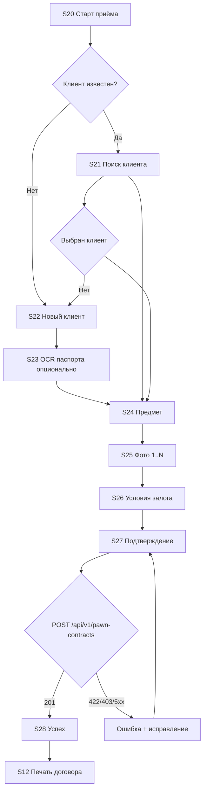

# Техническое задание: iPhone-приложение сотрудников ломбарда

**Проект:** pawn-shop-mvp (Laravel CRM)  
**Платформа:** iOS 16+ (iPhone), Swift / SwiftUI  
**Основание:** [MOBILE_APP_AUDIT.md](./MOBILE_APP_AUDIT.md)  
**Версия ТЗ:** 1.0  
**Дата:** 2026-05-23  

**Ограничение:** на этапе ТЗ **нативное приложение не разрабатывается** — только спецификация и согласование с backend.

---

## 1. Цель приложения

Мобильное приложение для **сотрудников ломбарда в точке продаж** — оформление и сопровождение **залоговых операций** без привязки к desktop-браузеру.

**Бизнес-цели:**

- Ускорить приём залога: клиент → предмет → фото → сумма → договор → печать.
- Дать оценщику и кассиру доступ к **активным и просроченным** договорам своей точки.
- Снизить ошибки при вводе данных (поиск клиента, OCR паспорта, справочники с сервера).
- Сохранить единый источник правды — **backend pawn-shop-mvp** (не запись в 1С с устройства).

**Не входит в цель v1:**

- Замена 1С, синхронизация с PostgreSQL 1С с iPhone.
- Полный бухгалтерский контур, кассовая книга, маркетинг, колл-центр, комиссия и скупка (отдельные релизы).

---

## 2. Основные пользователи

Авторизация по модели **`User`** (не `Employee`).

| Роль | Код | Использование приложения |
|------|-----|---------------------------|
| **Оценщик / товаровед** | `appraiser` | Основной пользователь MVP: приём залога, поиск клиентов и договоров |
| **Кассир** | `cashier` | MVP+: выкуп залога, просмотр сумм к оплате |
| **Менеджер точки** | `manager` | Приём + выкуп + просмотр всех договоров своего `store_id` |
| **Кладовщик** | `storekeeper` | v2: смена статуса товара / места хранения (вне MVP) |
| **Супер-администратор** | `super-admin` | Выбор точки при работе; полный доступ (опционально в MVP) |

**Привязка к точке:** у всех ролей, кроме `super-admin`, один `store_id`. Все запросы к API фильтруются по **разрешённым магазинам** (`allowedStoreIds()` на backend).

**Устройства:** iPhone с камерой; рекомендуется iPhone 12 и новее для стабильной съёмки и печати.

---

## 3. MVP-функции

### 3.1. В scope MVP (релиз 1.0)

| ID | Функция | Роли |
|----|---------|------|
| F01 | Вход / выход (email + пароль, токен) | Все |
| F02 | Профиль: ФИО, роль, текущая точка | Все |
| F03 | Синхронизация справочников (категории, бренды, статусы, места хранения, точки) | appraiser+ |
| F04 | Поиск клиента по ФИО / телефону | appraiser+ |
| F05 | Создание клиента (физлицо: ФИО, телефон, паспорт) | appraiser+ |
| F06 | OCR паспорта (камера → заполнение полей) | appraiser+ |
| F07 | Мастер **нового залога** (клиент → товар → фото → условия → подтверждение) | appraiser+ |
| F08 | Загрузка 1–10 фото предмета | appraiser+ |
| F09 | Список договоров залога точки (активные / просроченные / выкупленные) | appraiser+ |
| F10 | Карточка договора (клиент, товар, суммы, сроки, фото) | appraiser+ |
| F11 | Просмотр и печать договора (HTML в WebView + AirPrint) | appraiser+ |
| F12 | Поиск договора для выкупа (по клиенту / номеру договора) | cashier+ (если включено в MVP) |

### 3.2. Post-MVP (TestFlight / 1.1)

| ID | Функция |
|----|---------|
| F20 | Оформление **выкупа** из приложения |
| F21 | PDF договора (share / Files) |
| F22 | AI-оценка товара (опционально) |
| F23 | Push-уведомления о просрочке |
| F24 | Черновик приёма при обрыве сети |

### 3.3. Вне scope

- Комиссия, скупка, кассовые документы, зарплата, банк, маркетинг, база знаний, лендинг.
- Администрирование пользователей и магазинов с iPhone.

---

## 4. Полный список экранов

### 4.1. Общие

| # | Экран | Назначение |
|---|--------|------------|
| S00 | Splash / загрузка | Проверка токена, версии API |
| S01 | Вход | Email, пароль |
| S02 | Главная (табы) | Навигация по разделам MVP |

### 4.2. Залоги

| # | Экран | Назначение |
|---|--------|------------|
| S10 | Список залогов | Фильтры: активные / просроченные / выкупленные; поиск |
| S11 | Карточка залога | Детали договора, клиент, товар, фото |
| S12 | Печать договора | WebView / PDF, кнопки «Печать», «Поделиться» |

### 4.3. Новый залог (мастер)

| # | Экран | Назначение |
|---|--------|------------|
| S20 | Старт приёма | Выбор цели визита (оценка / идентификация — опционально) |
| S21 | Клиент: поиск | Поиск существующего |
| S22 | Клиент: новый / редактирование | ФИО, телефон, паспорт |
| S23 | Клиент: скан паспорта | Камера + OCR |
| S24 | Предмет: описание | Название, категория, бренд, описание, оценка |
| S25 | Предмет: фото | Галерея съёмки, превью, удаление |
| S26 | Условия залога | Сумма займа, %, даты, сумма выкупа (расчёт) |
| S27 | Подтверждение | Сводка перед отправкой |
| S28 | Успех | Номер договора, переход к печати |

### 4.4. Выкуп (TestFlight+)

| # | Экран | Назначение |
|---|--------|------------|
| S30 | Поиск для выкупа | Клиент + список активных договоров |
| S31 | Подтверждение выкупа | Сумма, договор |
| S32 | Успех выкупа | Итог |

### 4.5. Служебные

| # | Экран | Назначение |
|---|--------|------------|
| S40 | Профиль / настройки | Пользователь, точка, выход, версия app/API |
| S41 | Ошибка сети | Повтор, офлайн-сообщение |
| S42 | Принудительное обновление | Несовместимая версия API |

**Навигация MVP (Tab Bar):**

1. **Залоги** — S10  
2. **Приём** — S20 (мастер)  
3. **Профиль** — S40  

---

## 5. User flow оформления нового залога

Соответствует web-потоку `AcceptItemController::store` (`contract_type = pawn`), адаптированному под пошаговый UX.



### 5.1. Шаги и правила

| Шаг | Данные | Валидация |
|-----|--------|-----------|
| 1. Точка | `store_id` | По умолчанию `user.store_id`; super-admin выбирает из списка |
| 2. Клиент | `client_id` **или** блок `client{...}` | Телефон обязателен для нового; проверка blacklist на backend |
| 3. Предмет | `item.name`, `category_id`, `status_id`, цены | `name` обязательно; `status_id` = «Принят в ломбард» по умолчанию |
| 4. Фото | `photos[]` | Минимум 0 в MVP (рекомендация UX: минимум 1); max 5 MB/файл, JPEG/PNG/HEIC |
| 5. Займ | `loan_amount`, `loan_percent`, `loan_date`, `expiry_date` | Суммы ≥ 0; `expiry_date` ≥ `loan_date` |
| 6. Отправка | Один atomic API call | При успехе: касса + проводки + визит — на backend |

### 5.2. Расчёт суммы выкупа на клиенте

Для превью на S26 (как в web):

`buyback_amount = loan_amount + (loan_amount * loan_percent / 100)`

Финальное значение — с сервера в ответе `POST /pawn-contracts`.

### 5.3. После успеха

- Показать `contract_number`, `loan_amount`, `buyback_amount`, `expiry_date`.
- Кнопки: **«Распечатать договор»** → S12, **«К списку залогов»** → S10, **«Новый залог»** → S20.

---

## 6. API endpoints, которые будут использоваться

**Базовый URL:** `https://{host}/api/v1`  
**Заголовки:** `Authorization: Bearer {token}`, `Accept: application/json`, `Accept-Language: ru`

### 6.1. Уже существуют (ограниченно применимы)

| Метод | Путь | Использование в mobile |
|-------|------|------------------------|
| GET | `/api/clients` | **Не использовать в production** (нет auth) — заменить на v1 |
| GET | `/api/clients/{id}` | Аналогично |

### 6.2. Web JSON (временно недоступны для native без доработки)

Требуют session + CSRF — **не использовать** в iOS напрямую:

- `GET /clients/search`
- `GET /accept/redemption-search`
- `POST /accept/parse-passport`
- `POST /accept/ai-estimate`

Все переносятся в **`/api/v1/*`**.

### 6.3. Целевые endpoints v1 (использует приложение)

См. раздел 7 — полный список **новых** endpoint’ов. Приложение обращается **только** к `/api/v1`.

---

## 7. Endpoint’ы, которые нужно добавить в backend

Namespace: `App\Http\Controllers\Api\V1`, маршруты `routes/api.php` с префиксом `v1`, middleware `auth:sanctum`.

### 7.1. Auth

| Method | Path | Описание |
|--------|------|----------|
| POST | `/api/v1/auth/login` | `email`, `password`, `device_name` → Sanctum token + user + permissions |
| POST | `/api/v1/auth/logout` | Отзыв текущего токена |
| GET | `/api/v1/auth/me` | Текущий пользователь |

### 7.2. Справочники

| Method | Path | Описание |
|--------|------|----------|
| GET | `/api/v1/stores` | Магазины по `allowedStoreIds` |
| GET | `/api/v1/item-categories` | Категории |
| GET | `/api/v1/brands` | Бренды |
| GET | `/api/v1/item-statuses` | Статусы товара |
| GET | `/api/v1/storage-locations` | Query: `store_id` |
| GET | `/api/v1/meta/version` | `min_app_version`, `api_version` (для forced update) |

### 7.3. Clients

| Method | Path | Описание |
|--------|------|----------|
| GET | `/api/v1/clients/search` | `q` (min 2 символа), limit 20 |
| GET | `/api/v1/clients/{id}` | Карточка; query `include=pawn_contracts` (активные) |
| POST | `/api/v1/clients` | Создание физлица |
| PATCH | `/api/v1/clients/{id}` | Обновление паспортных полей |

### 7.4. Pawn contracts

| Method | Path | Описание |
|--------|------|----------|
| GET | `/api/v1/pawn-contracts` | Пагинация; filter: `store_id`, `status=active\|overdue\|redeemed`, `q` |
| GET | `/api/v1/pawn-contracts/{id}` | Договор + client + item + photos URLs |
| POST | `/api/v1/pawn-contracts` | **Создание залога** (JSON или multipart) |
| POST | `/api/v1/pawn-contracts/{id}/redeem` | Выкуп (TestFlight+) |
| GET | `/api/v1/pawn-contracts/redemption-search` | `q` → clients + contracts |
| GET | `/api/v1/pawn-contracts/{id}/print` | HTML (`Content-Type: text/html`) |
| GET | `/api/v1/pawn-contracts/{id}/print.pdf` | PDF (TestFlight+, опционально dompdf) |

### 7.5. Tools

| Method | Path | Описание |
|--------|------|----------|
| POST | `/api/v1/tools/parse-passport` | multipart `photo` → распознанные поля |
| POST | `/api/v1/tools/ai-estimate` | Post-MVP |

### 7.6. Backend: рефакторинг и политики

| Задача | Детали |
|--------|--------|
| Вынести логику приёма | Сервис `PawnContractCreationService` из `AcceptItemController::store` |
| API Resources | `PawnContractResource`, `ClientResource`, `ItemResource` |
| Form Requests | `StorePawnContractRequest`, `LoginRequest` |
| Policies | `PawnContractPolicy`: view/create/redeem по `store_id` и роли |
| Закрыть публичный API | Убрать или защитить `GET /api/clients` без токена |
| `computed_status` | Атрибут: `active`, `overdue`, `redeemed` |
| Единый формат ошибок | JSON 422/403/401 как в audit |
| OpenAPI | `docs/openapi-mobile-v1.yaml` |
| Тесты | Feature-тесты: login, create pawn, list, redeem |

### 7.7. Тело `POST /api/v1/pawn-contracts`

**Вариант A (рекомендуется для MVP):** `multipart/form-data`

| Поле | Тип |
|------|-----|
| `payload` | JSON string (store_id, visit_purpose, client_id или client{}, item{}, loan{}) |
| `photos[]` | file, image, max 5120 KB each |

**Вариант B:** чистый JSON без фото + отдельный `POST /items/{id}/photos` (сложнее, не для MVP).

---

## 8. Данные для локального хранения на iPhone

### 8.1. Keychain (обязательно)

| Ключ | Содержимое |
|------|------------|
| `api_token` | Sanctum personal access token |
| `token_created_at` | Для политики re-login |

Опционально: биометрическая разблокировка поверх сохранённого токена (App Store фаза).

### 8.2. UserDefaults / App Group (некритичные настройки)

| Ключ | Содержимое |
|------|------------|
| `api_base_url` | Staging / production (если не захардкожен) |
| `last_synced_at` | Время последней синхронизации справочников |
| `selected_store_id` | Для super-admin |

### 8.3. Core Data / SQLite / SwiftData (кэш)

| Сущность | TTL / обновление |
|----------|------------------|
| `CachedStore` | При login + pull-to-refresh, TTL 24 ч |
| `CachedItemCategory` | TTL 24 ч |
| `CachedBrand` | TTL 24 ч |
| `CachedItemStatus` | TTL 24 ч |
| `CachedStorageLocation` | По `store_id`, TTL 24 ч |
| `CachedPawnContractList` | Краткий кэш списка, TTL 5 мин (опционально) |

### 8.4. Файловая система (временные)

| Данные | Путь | Очистка |
|--------|------|---------|
| Фото до отправки | `tmp/pawn-draft/{uuid}/` | После успешного POST или отмены мастера |
| Кэш превью с сервера | `Caches/images/` | LRU, max 200 MB |

### 8.5. Не хранить локально

- Пароль в открытом виде (только ввод на экране login).
- Полные паспортные данные вне Keychain/зашифрованного контейнера без необходимости.
- Персональные данные других клиентов дольше сессии без политики retention (очищать кэш списка при logout).

### 8.6. Post-MVP: черновик приёма

| Поле | Хранение |
|------|----------|
| Незавершённый мастер S20–S27 | SwiftData `PawnDraft` до отправки или 7 дней |

---

## 9. Обработка фото предметов

### 9.1. Съёмка в приложении

- Источники: **камера** (основной), **галерея** (опционально).
- Формат отправки: **JPEG**, качество 0.8 после сжатия на устройстве.
- Максимальный размер после сжатия: **≤ 4 MB** (запас до лимита 5 MB backend).
- Разрешение: long edge ≤ **2048 px** (достаточно для оценки).
- Количество: **1–10** фото (UX-рекомендация: минимум 1; backend MVP допускает 0).

### 9.2. UX на S25

- Сетка превью, удаление, повторная съёмка.
- Индикатор загрузки при финальной отправке мастера.
- При ошибке сети — возможность повторить **только upload** без повторного ввода полей (если backend поддержит idempotency key — post-MVP).

### 9.3. Отправка на сервер

- В составе `POST /api/v1/pawn-contracts` как `photos[]`.
- Порядок файлов сохраняется в массиве `items.photos` на сервере.

### 9.4. Просмотр

- URL из API: `https://{host}/storage/items/{filename}` или signed URL.
- Кэширование на устройстве для карточки S11.
- Placeholder при отсутствии сети, если фото не в кэше.

### 9.5. Безопасность

- Только HTTPS.
- Не логировать бинарные данные в crash reports.

---

## 10. Договор и PDF

### 10.1. MVP: HTML + печать

| Аспект | Решение |
|--------|---------|
| Endpoint | `GET /api/v1/pawn-contracts/{id}/print` |
| Auth | Bearer token (backend отдаёт HTML без session cookie) |
| UI | `WKWebView` на экране S12 |
| Печать | `UIPrintInteractionController` / AirPrint |
| Подпись | Как в web: текстовая форма, без ЭЦП в v1 |

### 10.2. TestFlight+: PDF

| Аспект | Решение |
|--------|---------|
| Endpoint | `GET /api/v1/pawn-contracts/{id}/print.pdf` |
| Backend | dompdf или аналог, шаблон из `pawn-contracts/print.blade.php` |
| iOS | `PDFKit` preview + Share Sheet + AirPrint |

### 10.3. Альтернатива (если PDF отложен)

- Генерация PDF **на устройстве** из JSON договора (шаблон в app bundle) — дублирование логики с web, не рекомендуется как основной путь.

### 10.4. Юридические требования

- На печатной форме: номер договора, даты, ФИО клиента, паспорт, предмет, суммы, точка, принял (оценщик).
- Версия шаблона должна совпадать с web (единый Blade-шаблон на backend).

---

## 11. Авторизация

### 11.1. Механизм

- **Laravel Sanctum** — Personal Access Tokens.
- Login: `POST /api/v1/auth/login` → token.
- Все запросы: `Authorization: Bearer {plainTextToken}`.

### 11.2. Поток в приложении

1. S01: пользователь вводит email/password.
2. Успех → сохранить token в **Keychain**, загрузить `GET /auth/me` и справочники.
3. При 401 на любом запросе → очистить token → S01.
4. Logout: `POST /auth/logout` + очистка Keychain и кэшей.

### 11.3. Срок жизни токена

- Рекомендация backend: expiration **30 дней** или без срока с отзывом при logout.
- Refresh token — **не обязателен в MVP**; при истечении — повторный login.

### 11.4. Права на клиенте

Backend возвращает блок `permissions`:

```json
{
  "can_create_contracts": true,
  "can_process_sales": false,
  "can_manage_storage": false
}
```

UI скрывает «Приём» / «Выкуп» при `false`. Дублировать проверку на backend (403).

### 11.5. Окружения

| Окружение | Base URL (пример) |
|-----------|-------------------|
| Staging | `https://staging.lombard.example/api/v1` |
| Production | `https://lombard.home/api/v1` |

Конфигурация через xcconfig / build scheme, не hardcode в release без возможности смены staging.

---

## 12. Ошибки и edge cases

### 12.1. Сеть

| Ситуация | Поведение |
|----------|-----------|
| Нет интернета | Блокировка отправки мастера; справочники из кэша; banner «Нет сети» |
| Таймаут | Retry (до 2 раз) с exponential backoff |
| 5xx | Сообщение «Ошибка сервера», сохранить черновик (post-MVP) |

### 12.2. Авторизация

| HTTP | Поведение |
|------|-----------|
| 401 | Logout → экран входа |
| 403 | Alert «Недостаточно прав» |

### 12.3. Валидация (422)

- Показать поля из `errors` рядом с шагами мастера.
- Не сбрасывать введённые данные.

### 12.4. Бизнес-правила

| Case | Обработка |
|------|-----------|
| Клиент в blacklist | Backend 422; alert, приём запрещён |
| Дубликат телефона | Предложить найти существующего клиента |
| `store_id` не из allowed | 403 |
| Сумма займа = 0 | Валидация на клиенте и сервере |
| `expiry_date` в прошлом | Предупреждение на S26 |
| Повторная отправка мастера (double tap) | Disable кнопки + loading; idempotency post-MVP |
| Выкуп уже оформлен | 409 или 422 при redeem |
| Нет типа кассовой операции «Выдача займа» на backend | 500 с понятным message — эскалация админу |

### 12.5. Медиа

| Case | Обработка |
|------|-----------|
| Фото > 5 MB после сжатия | Предупреждение, повторное сжатие |
| Отказ в доступе к камере | Alert + переход в Настройки |
| HEIC | Конвертация в JPEG перед отправкой |

### 12.6. OCR паспорта

| Case | Обработка |
|------|-----------|
| API keys не настроены | 422 с текстом «OCR недоступен» |
| Низкое качество фото | Ручной ввод, подсказки по освещению |
| Частичное распознавание | Заполнить доступные поля, остальное вручную |

### 12.7. Версии

| Case | Обработение |
|------|-----------|
| `min_app_version` > текущей | Экран S42, блокировка работы |
| Устаревший кэш справочников | Pull-to-refresh на S10 / при входе |

---

## 13. Требования для TestFlight

### 13.1. Продукт

- [ ] MVP + **выкуп** (F20) или явное исключение из beta scope
- [ ] Стабильный staging API с HTTPS
- [ ] Печать договора (HTML минимум)
- [ ] Crashlytics (Firebase / Sentry)
- [ ] Экран «О приложении»: версия, build, контакт поддержки

### 13.2. Backend

- [ ] `/api/v1` развёрнут на staging
- [ ] Закрыт публичный clients API
- [ ] Тестовые учётки: appraiser, cashier, manager
- [ ] OpenAPI документация для QA

### 13.3. Apple Developer

- [ ] Apple Developer Program (организация)
- [ ] App ID, provisioning profiles
- [ ] Иконка 1024×1024, скриншоты 6.7" / 6.5"
- [ ] Beta App Description, инструкции для тестировщиков
- [ ] Export Compliance (encryption — стандартное HTTPS, обычно «No»)

### 13.4. QA-сценарии (минимум)

1. Login → sync справочников.
2. Поиск клиента → новый залог с 3 фото → печать.
3. Список: активный / просроченный фильтр.
4. Поиск выкупа → redeem → статус «выкуплен».
5. Logout / 401 recovery.
6. Клиент в blacklist.

### 13.5. Критерий выхода из TestFlight

- 2–3 точки, 5–10 сотрудников, **≥ 2 недели** без критических сбоев.
- Приём и выкуп без обращения к web-интерфейсу.

---

## 14. Требования для App Store

### 14.1. Контент и метаданные

- [ ] Название приложения (бренд ломбарда)
- [ ] Подзаголовок, описание RU, ключевые слова
- [ ] Политика конфиденциальности (URL) — **обязательно** (паспортные данные, фото)
- [ ] Support URL, marketing URL (опционально)
- [ ] Возрастной рейтинг (вероятно 4+ / 12+ в зависимости от контента)
- [ ] Скриншоты и preview без персональных данных реальных клиентов

### 14.2. Конфиденциальность (App Privacy)

Заявить сбор:

| Тип данных | Цель |
|------------|------|
| Контактные (телефон) | Функциональность |
| Идентификаторы (user id) | Функциональность |
| Фото | Функциональность (предметы, паспорт OCR) |
| Другие (ФИО, паспорт) | Функциональность |

- Данные **не для трекинга** рекламы.
- Хранение на сервере организации, не передача брокерам.

### 14.3. Безопасность

- [ ] Только HTTPS (ATS exception — не использовать без обоснования)
- [ ] Keychain для токена
- [ ] Опционально: Face ID / Touch ID для повторного входа
- [ ] Jailbreak detection — по решению ИБ (не блокировать жёстко без политики)

### 14.4. Надёжность и поддержка

- [ ] Forced update при несовместимой версии API
- [ ] Локализация: **русский** (MVP), английский опционально
- [ ] Accessibility: Dynamic Type, VoiceOver на ключевых экранах (минимум login, мастер)
- [ ] Обработка фона: прерывание мастера — восстановление состояния (post-MVP draft)

### 14.5. Юридическое

- [ ] Согласие на обработку ПДн в процессе приёма (если требует compliance) — уточнить у юристов сети
- [ ] Приложение **только для сотрудников** (B2E): рассмотреть **Apple Business Manager / unlisted** distribution, если не публичный App Store

### 14.6. Технические лимиты Apple

- [ ] Background modes — не требуются в MVP
- [ ] Push — entitlement при включении F23
- [ ] Camera / Photo Library usage descriptions в `Info.plist` (локализованные строки)

**Пример `NSCameraUsageDescription`:**  
«Камера нужна для фотографий залогового имущества и сканирования паспорта клиента.»

**Пример `NSPhotoLibraryUsageDescription`:**  
«Доступ к галерее для выбора фото предмета залога.»

---

## Приложение A. Матрица экранов × API

| Экран | API |
|-------|-----|
| S01 Login | POST `/auth/login` |
| S10 Список | GET `/pawn-contracts` |
| S11 Карточка | GET `/pawn-contracts/{id}` |
| S12 Печать | GET `/pawn-contracts/{id}/print` |
| S21 Поиск клиента | GET `/clients/search` |
| S22 Клиент | POST/PATCH `/clients` |
| S23 OCR | POST `/tools/parse-passport` |
| S27 Отправка | POST `/pawn-contracts` |
| S30 Выкуп поиск | GET `/pawn-contracts/redemption-search` |
| S31 Выкуп | POST `/pawn-contracts/{id}/redeem` |

---

## Приложение B. Приоритет разработки backend

| Приоритет | Endpoint / задача |
|-----------|-------------------|
| P0 | auth/login, auth/me, pawn-contracts POST/GET |
| P0 | clients/search, stores, справочники |
| P0 | pawn-contracts print HTML |
| P1 | redemption-search, redeem |
| P1 | parse-passport, computed_status |
| P2 | print.pdf, ai-estimate, meta/version |

---

## Приложение C. Связанные документы

- [MOBILE_APP_AUDIT.md](./MOBILE_APP_AUDIT.md) — аудит текущего состояния
- [docs/PROJECT_OVERVIEW.md](./docs/PROJECT_OVERVIEW.md) — обзор системы
- Web-приём: `AcceptItemController`, маршруты `accept.*`

---

## История изменений

| Версия | Дата | Изменения |
|--------|------|-----------|
| 1.0 | 2026-05-23 | Первая версия ТЗ на основе аудита |
